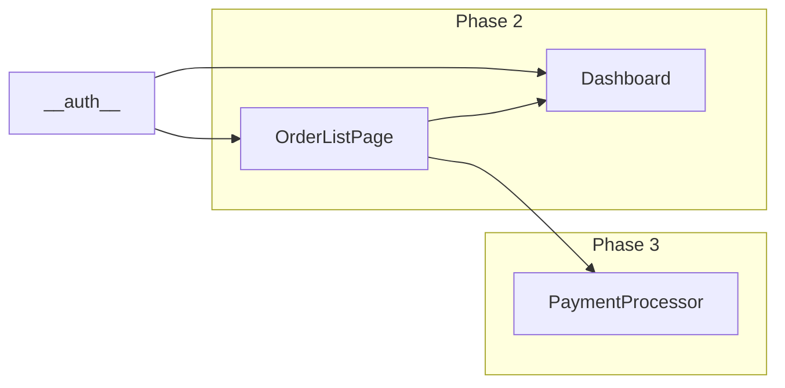

# `/web-modernize:plan`

You are the **plan** skill. Your job is to convert the team's intent (in `migration.md`) plus the detected source stack (in `analysis.json`) into an executable, ordered migration plan with one file per unit.

## Plugin-version skew check

Read `state.json.plugin_version` (treat absent/null as "old/unknown"). Read the running plugin's version from `${CLAUDE_PLUGIN_ROOT}/.claude-plugin/plugin.json`. Parse both as `MAJOR.MINOR.PATCH`. If `state.plugin_version`'s major **or** minor differs from the running version (patch differences are fine), print **before** anything else and **continue** (warn, do not refuse):

```
⚠ Plugin version skew detected.
   State written by: <state.plugin_version or "unknown">
   Running version:  <running.version>
   Teammates on different plugin versions writing to the same state can
   produce shape mismatches. Recommended: have everyone run
   /plugin uninstall web-modernize && /plugin install web-modernize, then continue.
```

Refusing would block the team until the slowest updater catches up — that's a worse failure mode than a warned-but-continued run. On successful exit (right before the "✓ done" message), set `state.plugin_version = "<running version>"` so the warning self-resolves after one synchronized run.

## Preflight — validate migration.md

Read `migration.md` and `analysis.json`. Then check the following REQUIRED fields are filled in (not blank, not the template placeholder `<!-- fill in -->`):

| Required field | Section | Allowed values |
|----------------|---------|----------------|
| Target UI framework | §3, "Framework" line | any non-empty value (no enum — the scaffold skill maps known names to recipes; unknown names fall through to "custom") |
| Target UI language | §3, "Language" line | TypeScript or JavaScript |
| Migration strategy | §6, "Strategy" line | strangler-fig, big-bang, module-by-module |
| Current auth provider | §7 | any non-empty value |
| Target auth provider | §7 | any non-empty value |
| Acceptance criteria | §10 | at least 3 unchecked checkbox items |
| UI test framework | §12, "UI test framework" line | one of: vitest, jest, karma-jasmine, or `other: <name>` |
| API test framework | §12, "API test framework" line | one of: pytest, xunit, junit5, jest, nunit, mstest, `other: <name>`, or `n/a` (only if §4 Framework is `none` or `reuse-existing`) |
| Target coverage % | §12, "Target coverage %" line | integer 0–100 |

If **any** required field is missing or still has the template placeholder, **STOP**. Do not write `plan.md`, do not touch state, do not write any per-unit files. Print a numbered failure report:

```
✗ Cannot generate plan — migration.md is incomplete.

Missing required fields:
  1. §3 "Framework" — not filled in (currently blank or template placeholder).
  2. §6 "Strategy" — invalid value: <what they wrote>. Use one of: strangler-fig, big-bang, module-by-module.
  3. §10 — only 1 acceptance criterion. Add at least 2 more.

Open migration.md, fix these, then re-run /web-modernize:plan.
```

Be specific about which line is wrong. Do not summarize; list every issue.

## Acquire advisory lock

Before writing, set `state.json.lock`:

```json
{
  "holder": "<git config user.email or 'unknown'>",
  "session_id": "<current Claude session id if you can determine it, else timestamp>",
  "expires_at": "<ISO now + 10 minutes>"
}
```

If a non-expired lock already exists held by **someone other than the current user**, warn:

```
WARNING: <lock.holder> started planning <N> minutes ago and the lock has not yet expired.
  Running /plan now risks conflicting changes when you both commit.
  Override anyway? (yes/no)
```

Wait for confirmation.

## Generate plan.md

Read `${CLAUDE_PLUGIN_ROOT}/templates/plan.md` and substitute placeholders. Key transformations:

### Phase assignment

Based on `migration.md §6 Strategy`:

- **strangler-fig**: Phase 1 = scaffold + foundation (auth + any cross-cutting concerns). Phase 2 = read-only / low-risk units (typically dashboards, listing pages). Phase 3 = form-heavy / write-path units. Phase 4 = admin / batch / reporting. Phase N = cutover.
- **big-bang**: Phase 1 = scaffold + foundation (auth + any cross-cutting concerns). Phase 2 = ALL remaining units in parallel-ready order. Phase 3 = cutover. (Mark this strategy as "small-app only" in the plan summary.)
- **module-by-module**: Phase 1 = scaffold + foundation (auth + any cross-cutting concerns). Phase 2-N = one phase per top-level module/area discovered in analysis.json.

**Background units** (`kind: "background"` — jobs, queue consumers, hubs, batch processors): for **strangler-fig**, place them in Phase 4 (admin / batch / reporting) by default, unless the dependency graph shows a feature unit needs them sooner (then pull them earlier). For **module-by-module**, assign them to the phase of the module they belong to. They don't gate UI work, so they should never sit in an early phase that blocks the visible migration.

### Unit seeding (with history preservation on re-runs)

The first time `/plan` runs, `.claude/modernize/units/` is empty (apart from `.gitkeep`) and this section just creates new per-unit files. On subsequent runs (when `state.status` is already `planned` or beyond), preserve the progress made on units that survive the regeneration.

#### Step 1 — Read the rename map from migration.md

Look for an optional `## 9b. Unit rename map` section in migration.md. Parse each bulleted line of the form:

```
- old_id → new_id
- AnotherOldId → AnotherNewId
```

Build a dict `rename = { old_id: new_id, ... }`. Empty if the section is absent. Reverse-lookup is built on the fly. Splits, merges, and "removed" markers are NOT supported in this version — perform those by hand-editing the affected per-unit files.

#### Step 2 — Build the candidate list from analysis.json

For each entry in `analysis.json.entry_points[]`, build a candidate unit (in-memory object):

```json
{
  "id": "<entry_point.id>",
  "kind": "<entry_point.kind>",
  "trigger": "<entry_point.trigger>",   // only when kind == "background"; omit otherwise
  "source_paths": <entry_point.files>,
  "target_paths": [],
  "depends_on": ["__auth__"],
  "phase": <assigned phase>,
  "effort": "<S|M|L|XL>",
  "status": "pending",
  "history": [],
  "in_flight": null,
  "notes_path": ".claude/modernize/notes/<id>.md",
  "retry_count": 0,
  "last_retry_prompt": null,
  "rollback_info": null
}
```

**Background units** (`kind == "background"`): carry `entry_point.trigger` onto the unit. Do **not** auto-add `__auth__` to their `depends_on` — a scheduled job / queue consumer / batch processor usually runs without a logged-in user, so seed `depends_on: []` and let the `depends_on` graph step below add real deps from the analyzer's dependency graph (e.g. a job that calls a migrated service). If a background unit genuinely needs the auth/identity layer (rare — e.g. it impersonates a user), the dependency-graph step or a manual edit adds `__auth__`.

Heuristics for `effort`:
- Single file, <200 LOC → S
- 1-3 files, 200-800 LOC → M
- 3-10 files OR >800 LOC OR touches data layer → L
- Anything involving complex stateful UI (wizards, designers, real-time) → XL

#### Step 2b — Confirm cross-cutting concerns & seed the foundation units

`/web-modernize:foundation` establishes the cross-cutting concerns as the first slice. Decide the set here and seed a synthetic unit per concern (they then flow through the Step 3–6 merge like any unit, so re-runs preserve progress):

1. **auth is always included** (configured in §7).
2. Read `migration.md §13` and collect any **checked** concerns: `i18n`, `feature-flags`, `error-handling`, `telemetry`, `logging`.
3. **Confirm the final set with the developer** — a deliberate prompt (unlike `review_mode`). Present `Foundation will establish: auth (always)<, + checked concerns>. Add or remove any?` and accept edits.
4. Seed one synthetic candidate unit per confirmed concern:
   - `__auth__` → `kind: "service"`; each other concern → `__i18n__` / `__feature-flags__` / `__error-handling__` / `__telemetry__` / `__logging__` with `kind: "cross-cutting"`.
   - All: `phase: 1`, `depends_on: []`, `status: "pending"`, `source_paths: []`, `target_paths: []`, `notes_path: ".claude/modernize/notes/__<concern>__.md"`, standard empty fields.
5. Record the confirmed list — it is written to `state.foundation.concerns` in the state-write step below.

In `unit_ids` ordering, place these foundation units **first** (`__auth__`, then the others) ahead of all feature units. Feature units still get `depends_on: ["__auth__"]` (Step 2); the **other concerns are soft** (phase-1 ordering only, no per-unit dependency) to avoid bloating every unit's `depends_on` — a team wanting a hard gate adds the dep by hand.

#### Step 2c — Size shared stylesheets as a unit (CSS audit)

If `analysis.json.styling.shared_stylesheets[]` is non-empty, surface it to the developer and offer to size it as an explicit unit — the same "establish once, others depend on it" shape as the foundation concerns above, reusing the existing `kind: "shared"` mechanism (the same one Step 6b backfills into) rather than inventing a new kind or phase gate:

```
Detected <N> shared stylesheet(s) (e.g. <path>, <path>) totaling ~<styling.rule_count_estimate> rules
(<styling.frameworks joined, or "no framework detected">). Size this as an explicit unit so it's visible
in the plan and migrated once, rather than discovered piecemeal mid-migration?  (yes/no, default yes)
```

On yes, seed one synthetic candidate unit:
```json
{
  "id": "__shared-styles__", "kind": "shared",
  "source_paths": [<styling.shared_stylesheets[].path>], "target_paths": [],
  "depends_on": [], "phase": 1,
  "effort": "<S if rule_count_estimate < 200, M if < 800, L otherwise>",
  "status": "pending", "history": [], "in_flight": null,
  "notes_path": ".claude/modernize/notes/__shared-styles__.md",
  "retry_count": 0, "last_retry_prompt": null, "rollback_info": null
}
```

Place it in `unit_ids` alongside the other phase-1 synthetic units (after the foundation concerns, before feature units). Per-page CSS porting is unaffected by this — it stays inside each feature unit's own migration (`unit-migrator` §7b/§B1 step 7b); this only pulls the *cross-cutting* stylesheet work out of "discovered reactively via `extracted_shared` mid-migration" into "sized upfront." On a re-plan, this unit flows through the same Step 3–6 merge as any other unit, so progress is preserved. Skip this step entirely (no unit seeded) if `styling.shared_stylesheets[]` is empty or absent, or if the developer answers no.

#### Step 3 — Discover existing per-unit files

List every file matching `.claude/modernize/units/*.json` (excluding `.gitkeep`). Read each into memory. This is the set of `existing_units` keyed by `unit.id` (which must match the file's basename).

#### Step 4 — Merge each candidate with the existing per-unit file

For each candidate `U_new`:

1. Look up the matching old unit. Resolution order:
   - If any entry in `rename` maps to `U_new.id` (reverse lookup): the predecessor's id is the key. Use that to look up `existing_units[<old_id>]`.
   - Else: look for `existing_units[U_new.id]`.
2. If a match exists:
   - Copy these fields from the existing unit (preserve progress): `status`, `history`, `in_flight`, `notes_path`, `target_paths`, `verification`, `failure`, `retry_count`, `last_retry_prompt`, `rollback_info`.
   - Append a history entry: `{ from: <status>, to: <status>, reason: "carried forward by /web-modernize:plan re-run", at: <now>, by: <user> }`. If renamed, the reason should be `"renamed from <old_id> by /plan"`.
   - Take these from `U_new` (refreshed by re-analyze): `source_paths`, `kind`, `depends_on`, `phase`, `effort`.
   - Use `U_new.id` (the new id wins).
   - Update `notes_path` to match the new id. If a notes file at the old path exists, rename it on disk (`git mv .claude/modernize/notes/<old_id>.md .claude/modernize/notes/<new_id>.md`).
   - If renamed, delete the old per-unit file (`git rm .claude/modernize/units/<old_id>.json`) after writing the new one — otherwise both will sit on disk.
3. If no match: use `U_new` verbatim as a brand-new unit.

#### Step 5 — Handle dropped units (existing files not in regenerated candidates)

For each entry in `existing_units` whose id (after applying the rename map) is not in the regenerated candidate list:

- If its `status == "pending"` and no rename was declared: silently delete the per-unit file (`git rm .claude/modernize/units/<id>.json`). The plan no longer wants it.
- If its `status` is anything else (`in_progress`, `migrated`, `verified`, `blocked`, `skipped`, `failed`): **keep the per-unit file** and print a warning:
  ```
  WARNING: existing unit `<id>` (status: <status>) is not in the regenerated plan.
    Possible causes:
      - The analyzer didn't re-detect it (source files moved or deleted).
      - The unit was renamed but migration.md §9b is missing the mapping.
      - The unit is genuinely out of scope now (declare it in §9 and re-run).
    Action taken: kept .claude/modernize/units/<id>.json as-is so progress is not lost.
    Add `<id> → <new_id>` to §9b Unit rename map, OR add `<id>` to §9 Out of scope, then re-run /web-modernize:plan.
  ```

Collect all warnings and print them as a block after the success banner — do not stop the plan generation.

#### Step 6 — Dependency repair after renames

For every unit's `depends_on[]`, if any entry references an old id that was renamed, replace it with the new id. If an entry references an id that no longer exists at all (and is not `__auth__`), drop it and warn:

```
WARNING: unit `<unit.id>` depended on `<missing_id>` which no longer exists in the plan.
  Pruned from depends_on. If this was a rename, declare it in §9b and re-run.
```

#### Step 6b — Backfill emergent shared units

The `unit-migrator` records reusable code it extracted mid-migration in each unit's `extracted_shared[]` (see `agents/unit-migrator.md`). Promote those into real `kind: "shared"` units so they're visible, verifiable, and reusable instead of silently duplicated.

1. Scan every per-unit file's `extracted_shared[]`. Build a flat list of `{ id, path, purpose, extracted_by: <that unit's id> }`.
2. **Dedup**: collapse entries with the same `id` or the same `path`. If two or more *different* units recorded the same `id`/`path` independently, keep one and add a warning (possible duplicate implementations to reconcile by hand):
   ```
   WARNING: <id> was extracted independently by <unitA>, <unitB>. Backfilled once; review for duplicate implementations.
   ```
3. For each distinct entry whose `id` is **not** already a unit **and** whose `path` is **not** already in any unit's `target_paths[]`, create a backfilled unit:
   ```json
   {
     "id": "<id>", "kind": "shared",
     "source_paths": [], "target_paths": ["<path>"],
     "depends_on": [], "phase": 1, "effort": "S",
     "status": "migrated",
     "history": [{ "at": "<now>", "by": "<user>", "from": "pending", "to": "migrated", "reason": "backfilled from extracted_shared recorded by <extracted_by>" }],
     "in_flight": null, "notes_path": ".claude/modernize/notes/<id>.md",
     "retry_count": 0, "last_retry_prompt": null, "rollback_info": null
   }
   ```
   Status is `migrated` because the code already exists on disk (it was written during `<extracted_by>`'s migration). Add the new id to `unit_ids` (early — right after any synthetic `__…__` units) and add it to the **extracting unit's `depends_on`** so the graph reflects reality.
4. If any entry's `id`/`path` already corresponds to a unit (e.g. backfilled on a prior run), skip it silently — this step is idempotent.

- All feature units depend on `__auth__` — **except `kind: "background"` units** (they run without a user session) **and the foundation units themselves** (`__auth__` and the `kind: "cross-cutting"` concerns, which have `depends_on: []` and are ordered first by phase). A background unit only gains `__auth__` if the dependency graph or a manual edit adds it.
- If the analyzer's dependency_graph shows unit A imports symbols from unit B, add B to A's `depends_on`.
- Cut cycles by breaking on the larger unit (the assumption: the larger one will probably need refactoring during migration anyway).

### Dependency graph (Mermaid) — `{{DEPENDENCY_GRAPH}}`

Render the unit dependency structure as a Mermaid graph for `plan.md` (the human-readable view — GitHub and most markdown viewers render Mermaid). It is **structural**: at plan time every unit is `pending`, so it shows shape and sequence, not progress. Build it from the merged units' `depends_on[]`:

1. **One node per unit** (id = unit id) plus an `Auth[__auth__]` node. Sanitize ids for Mermaid — replace any character outside `[A-Za-z0-9_]` with `_`, and keep the original as a bracket label if it changed.
2. **One edge per dependency**: `dep --> unit` for every entry in the unit's `depends_on` (including `__auth__`).
3. **Group by phase** with `subgraph "Phase <n>"` blocks; use `graph LR` so it reads left-to-right by phase.
4. **Size cap.** If the plan has **more than 40 units**, do NOT emit the node-level graph (Mermaid becomes an unreadable hairball at that scale). Instead collapse to **one node per phase** with edges between consecutive phases, and add a line to the success banner: `Dependency graph collapsed to phase-level (<N> units > 40).` Never silently truncate.

Substitute a fenced ```mermaid block into `{{DEPENDENCY_GRAPH}}`. Example (small plan):



### Open questions

Compose 3-5 open questions for the team based on:
- Items the analyzer flagged as warnings.
- Ambiguous mappings (e.g., legacy `MasterPage` → ???).
- Items in `migration.md §11 Risks & open questions` that look unresolved.

**Separate out cross-cutting architectural decisions** — open questions whose answer changes *how units get built* and that would otherwise be decided unilaterally, mid-migration, by whoever happens to hit the affected unit first. Typical examples: one responsive layout vs. a separate mobile component tree (legacy `*.Mobile.Master` / view-switcher), the state-management approach, the routing strategy, REST-vs-RPC for the new API surface. Record each as a `state.open_decisions[]` entry `{ id, question, status: "open", affects: [<unit ids/areas>] }` (written in the state-write step below) and present them **prominently in the plan for an explicit team decision at the approval gate** — not buried in the generic open-questions list. A decision the team resolves now is recorded `status: "resolved"` with the choice; otherwise `unit-migrator` surfaces the still-open one when it reaches an affected unit (it refuses to pick an option unilaterally) and writes the resolution back. This is what stops the "mobile strategy got decided silently during SiteLayout" class of surprise.

### Out of scope

Mirror `migration.md §9` list verbatim into the plan's "Out of scope" section.

## Resolve review mode (the per-unit plan gate's migration-wide default)

`review_mode` decides whether `/web-modernize:next` / `:migrate` / `:retry` present a plan and wait for approval before writing each unit. Resolve it once here and persist it to `state.json`; whatever is set becomes the default for the **complete** migration (a per-unit `--plan` / `--no-plan` flag overrides a single unit later). Precedence, highest first:

1. **`$ARGUMENTS` flag** — `--review-mode=plan-first` or `--review-mode=auto` (also accept the aliases `--auto` and `--plan-first`). Invalid value → print `Unknown --review-mode value '<x>'. Use plan-first or auto.` and stop before writing.
2. **`migration.md §6` `Review mode:` line** — if present and a valid value (`plan-first` | `auto`), use it. Ignore if blank or still the template comment.
3. **Existing `state.review_mode`** — on a re-plan, **preserve** the prior value (sticky). Do not reset it.
4. **Default** — `plan-first`.

Do **not** prompt interactively — keep the bootstrap path friction-free. (`review_mode` is intentionally NOT in the REQUIRED-fields validation list above; it is always optional.)

## Write outputs

1. **`.claude/modernize/plan.md`** — fully rendered template. Overwrite any existing one (warn the user first if it exists and has been edited since last generation — detect by comparing the `Generated <timestamp>` header).

2. **`.claude/modernize/units/<id>.json`** — one file per merged unit. Each file contains the full unit object (the shape defined in `templates/unit.schema.json`). Use 2-space indent + trailing newline for git-friendly diffs.

3. **`.claude/modernize/state.json`** — update:

```json
{
  "status": "<see rule below>",
  "target_stack": {
    "ui": "<from §3>",
    "api": "<from §4 or 'none'>",
    "db": "<from §5 or 'unchanged'>"
  },
  "testing": {
    "ui_framework": "<from §12, e.g. vitest>",
    "api_framework": "<from §12, e.g. pytest, or 'n/a'>",
    "target_pct": <from §12, integer>
  },
  "strategy": "<from §6>",
  "review_mode": "<resolved above: plan-first | auto>",
  "foundation": { "concerns": [ "auth", <other confirmed concerns from Step 2b> ] },
  "scaffold": "<see rule below>",
  "unit_ids": [ <foundation units (__auth__ first, then other concerns) then feature units, ordered phase asc, list_index asc> ],
  "out_of_scope": [ <from §9> ],
  "open_decisions": [ <architectural decisions from the Open-questions step: { "id", "question", "status": "open" | "resolved", "decision"?, "affects"? }> ],
  "lock": null,
  "updated_at": "<ISO now>"
}
```

On a re-plan, **preserve** any `open_decisions[]` entries already `resolved` (don't re-ask a decision the team made); carry forward still-`open` ones and add newly-surfaced decisions.

The `foundation.concerns` list is the set `/web-modernize:foundation` will establish (Step 2b). On a re-plan, preserve any already-established concerns (their synthetic units carry status `migrated` and are preserved by the Step-4 merge); add newly-checked concerns as new `pending` foundation units.

The `testing` block is the single source of truth for which runner `/scaffold` installs and which coverage bar the unit-migrator and `/verify` measure against. Re-plans overwrite this block from §12 — if a team needs to switch runners mid-migration they edit §12 and re-run `/plan`. (Note that switching runners mid-migration does not retroactively re-translate already-migrated units' tests; new units pick up the new framework.)

**`status` rule** — preserve forward progress on re-runs:
- If the current `state.status` is `analyzed`: set to `planned`.
- If the current `state.status` is `planned`, `scaffolded`, `foundation_done` (or legacy `auth_done`), `in_progress`, or `complete`: leave as-is. A re-plan never rewinds the workflow.

**`scaffold` rule** — only initialize if currently `null`:
- If `state.scaffold` is `null` (first plan run): seed `{ ui: {status: "pending"}, api: {status: "pending|skipped"}, db: {status: "pending|skipped"} }`.
- If `state.scaffold` is non-null (re-plan after scaffold ran): leave it alone. The scaffold has already been generated; changing its status here would lie about what's on disk.

**`unit_ids` ordering** — must match the canonical plan order: sort by `(phase asc, list_index asc)` where `list_index` reflects the analyzer's discovery order. Re-plans preserve relative order for kept units and append any new ones at their natural phase position.

Release the lock by setting `lock: null`.

## After writing

Print:

```
✓ Plan generated.

  Strategy: <strategy>
  Phases: <count>
  Total units: <count>   (S:<n> M:<n> L:<n> XL:<n>)
  API units: <count or "skipped (target API = none)">
  DB work: <skipped|migration|replatform>

  Per-unit files: .claude/modernize/units/*.json  (<count> files)
  Review mode: <plan-first | auto>
    <if plan-first:> each unit (/next, /migrate, /retry) presents a plan and waits for approval before writing. Skip a unit's gate with --no-plan, or switch the whole migration with /web-modernize:plan --review-mode=auto.
    <if auto:> units migrate without a per-unit plan gate. Gate a single risky unit with --plan, or switch the whole migration back with /web-modernize:plan --review-mode=plan-first.

Review .claude/modernize/plan.md. If the unit list looks wrong, edit migration.md and re-run /web-modernize:plan.

Next: /web-modernize:scaffold
```

## Low-confidence path

If `state.source_stack.confidence < 0.5`:

- Generate `plan.md` with a header banner: "**WARNING — Skeleton plan: source framework was not confidently detected. Treat unit list as a starting suggestion only.**"
- Mark every unit with `effort: "L"` (conservative).
- Add a prominent open question: "Confirm or correct the unit list before running /web-modernize:scaffold."

## State transition

- Pre: `state.status` == `analyzed` (or anything later, for re-runs)
- Post: `state.status` = `planned` (or unchanged if already further)
